# ATLAS Backoffice — Phase 0 Baseline & Contract Map
**Document ID:** ATLAS-BO-OPS-P0-2026-10-08  
**Program:** ATLAS Backoffice Production Operations Program  
**Phase:** Phase 0 — Baseline & Contract Map  
**Timestamp:** 2026-10-08T18:35:00+05:30  
**Author:** Antigravity (Advanced Agentic Coding Assistant)  
**Chief Architect / Operator:** Nomesh De Silva  
**Status:** COMPLETE — PENDING ARCHITECT APPROVAL (PHASE GATE 0)

---

## 1. Executive Summary & Program Objective

The primary objective of the **ATLAS Backoffice Production Operations Program** is to transform `forge-atlas-backoffice` into the unified, production-grade management and control plane for the Neural Works ATLAS ecosystem (encompassing **ATLAS Enterprise / Professional Core**, **ATLAS Learn**, **ATLAS RESOLVE Personal / Teams**, and shared intelligence services).

This program operates in **strict parallel** with active development streams conducted by Claude. In compliance with the **CRITICAL ISOLATION RULE**, no changes are made directly to `backend master` or `Backoffice main`. Dedicated isolated branches and worktrees have been initialized from authoritative production lineages.

**Phase 0 establishes the exhaustive operational baseline, end-to-end capability classification, component dependency contracts, and strict collision isolation boundaries before any Phase 1 code modification begins.**

---

## 2. Lineage & Git Isolation Topology

### 2.1 Authoritative Production Lineages
- **Backend (`forge-atlas-api`):**
  - **Remote Production HEAD:** `origin/master` at commit `31bacfd73a697611ccc755799e6d07a65aaf204a`
  - **Commit Message:** `fix(learn): metadata-only Tutor logs; no learner text, answers, excerpts or usernames` (Co-Authored-By: Claude Opus 5.5, Nomesh De Silva, 2026-10-08 17:05:38 +0530)
- **Backoffice Frontend (`forge-atlas-backoffice`):**
  - **Remote Production HEAD:** `origin/main` at commit `87987bd0415a01ed4f8fecb1d9fa93f0107b0cd9`
  - **Commit Message:** `feat(curriculum): enforce fail-closed DB catalogue, grade scoping, and suggestion guards` (Nomesh De Silva, 2026-10-05 23:38:01 +0530)

### 2.2 Dedicated Operations Branches & Worktrees Created
1. **Backoffice Frontend:**
   - **Branch:** `feature/backoffice-production-ops`
   - **Base:** `origin/main` (`87987bd`)
   - **Working Tree:** `d:\Development\Spring AI\forge-atlas-backoffice`
   - **Tracking:** `origin/main`
2. **Backend API:**
   - **Branch:** `feature/backoffice-production-ops`
   - **Base:** `origin/master` (`31bacfd`)
   - **Dedicated Worktree:** `D:\Development\Spring AI\forge-atlas-api-backoffice-ops`
   - **Tracking:** `origin/master`
   - **Git Safe Directory:** Registered globally via `git config --global --add safe.directory`

### 2.3 Sibling Worktree & Active Feature Branch Inventory
The workspace currently contains active parallel worktrees managed by Claude, Codex, and feature teams:
- `d:\Development\Spring AI\atlas-learn-ui`: Active dirty working tree on `fix/teach-me-regression-remediation` (Claude in-flight modifications to `tutorApi.ts`, `TutorPage.tsx`, `index.ts`, `SourceVisualCard.tsx`). **DO NOT TOUCH.**
- `d:\Development\Spring AI\forge-atlas-api-logprivacy`: Branch `fix/learn-tutor-log-privacy` (`31bacfd`). **DO NOT TOUCH.**
- `d:\Development\Spring AI\forge-atlas-api-crosslingual`: Branch `fix/learn-crosslingual-science` (`eb9bcbc`). **DO NOT TOUCH.**
- `d:\Development\Spring AI\forge-atlas-api-integrity`: Branch `fix/learn-content-integrity` (`6b5cb34`). **DO NOT TOUCH.**
- `d:\Development\Spring AI\forge-atlas-api-learn-abuse`: Branch `fix/learn-auth-abuse-protection` (`28deeda`). **DO NOT TOUCH.**
- `d:\Development\Spring AI\forge-atlas-api-learn-auth`: Branch `fix/learn-production-auth` (`ba24a97`). **DO NOT TOUCH.**
- `d:\Development\Spring AI\forge-atlas-api-apionly`: Branch `fix/api-only-deploy-linux-harness` (`25ebb7c`). **DO NOT TOUCH.**
- `d:\Development\Spring AI\forge-atlas-api-learn-ui-deploy`: Branch `fix/learn-ui-immutable-deploy` (`8c06c75`). **DO NOT TOUCH.**
- `d:\Development\Spring AI\forge-atlas-api-learn-tls`: Branch `fix/learn-tls-certificate` (`b7c9bd4`). **DO NOT TOUCH.**
- `d:\Development\Spring AI\forge-atlas-api-learn-cors-clean`: Branch `fix/learn-production-cors-clean` (`36b5936`). **DO NOT TOUCH.**
- `d:\Development\Spring AI\forge-atlas-api-deploy-integration`: Branch `integration/production-deploy-security` (`329e775`). **DO NOT TOUCH.**
- `C:/tmp/atlas-worktrees/forge-atlas-api-cap`: Branch `feature/youtube-product-capability` (`6743b01`). **DO NOT TOUCH.**
- `C:/tmp/atlas-worktrees/forge-atlas-backoffice-cap`: Branch `feature/youtube-product-capability` (`1655dc2`). **DO NOT TOUCH.**

---

## 3. End-to-End Capability Classification Matrix

Every system capability is classified under one of the strict lifecycle categories:
- **WORKING:** Operational end-to-end (UI → API → Security → Service → DB/Keycloak → Result verified).
- **PARTIAL:** Some layers functional, but critical production attributes or links are incomplete.
- **UI-ONLY:** Visible controls exist in the frontend, but link to mock data or have no backend backing.
- **BACKEND-ONLY:** API/Service/DB implemented, but entirely missing from the Backoffice UI.
- **MOCK:** Hardcoded dummy data or in-memory stubs masquerading as working capability.
- **MISSING:** Non-existent across both frontend and backend.

| Domain / Capability | UI Component | API Endpoint | Security Layer | Service & Worker | DB & Keycloak | Classification | Forensic Finding & Capability Assessment |
|---|---|---|---|---|---|---|---|
| **1. Customer Management** | `app/customers/**` | `GET/POST/PATCH /api/backoffice/v1/professional-onboardings` | `@PreAuthorize isPlatformAdmin` | `ProfessionalOnboardingService` | `atlas.customer`, `atlas_tenant`, `user_subscription` | **PARTIAL** | Working for single-user Professional customers with idempotency. Lacks organization entities, multiple tenants per customer, billing metadata, and soft-delete safeguards. |
| **2. Tenants** | None | Implicitly created during onboarding | `TenantResolutionFilter` | `ProfessionalOnboardingService.personalTenant()` | `atlas.atlas_tenant` | **BACKEND-ONLY / PARTIAL** | Tenants exist in DB and data-plane filter isolates them. No dedicated Backoffice UI exists to search, view, configure, or manage tenants. |
| **3. Provisioning Queue** | `app/page.tsx` (`<QueueItem>`) | None | None | `ProvisioningJobWorker` (no-op stub) | `atlas.provisioning_job` (`PENDING`, `RUNNING`, `SUCCEEDED`, etc.) | **MOCK (UI) / BACKEND-ONLY STUB** | UI displays hardcoded mock items ("Verde Advisory", "Oriel Partners"). Backend worker runs on `@Scheduled` but immediately marks jobs `SUCCEEDED` without provisioning Keycloak or cloud infra. |
| **4. Professional Users** | None | End-user self-binding only (`/api/onboarding/v1/identity-bindings`) | JWT validation | `ProfessionalOnboardingService.bind()` | `atlas.atlas_user`, `atlas.tenant_membership` | **MISSING (UI) / PARTIAL (BACKEND)** | No Backoffice UI to invite, deactivate, or assign roles to Professional users. Relies on out-of-band manual Keycloak user creation followed by user self-binding. |
| **5. Product Entitlements** | Customer detail cards (storage bytes) | Customer detail lookup | `plan_version` limits | `OnboardingRepository` | `atlas.plan_version` (single row: `PROFESSIONAL` v1), `tenant_storage_quota` | **PARTIAL** | Only storage quota (10 GiB) and device limit (2) are represented. Multi-product entitlement model (features, tokens, seats) is absent. |
| **6. Subscriptions** | Customer detail cards | Managed implicitly via customer lifecycle | `isPlatformAdmin` | `ProfessionalOnboardingService` | `atlas.user_subscription` (`ACTIVE`, `SUSPENDED`, `CANCELLED`) | **PARTIAL** | Subscriptions exist in DB tied 1:1 to onboarding. No standalone subscription catalog, upgrade/downgrade flows, or renewal tracking. |
| **7. Seats** | None | None | None | None | Assumes 1 user per customer | **MISSING** | No seat allocation, seat consumption, or multi-seat pooling model exists. |
| **8. Devices** | None in Backoffice | Professional self-service (`/api/devices`), Learn admin reset (`/api/learn/admin/students/{id}/reset-devices`) | `ProfessionalDeviceFilter`, `LearnDeviceService` | `ProfessionalDeviceService`, `LearnDeviceService` | `atlas.user_device_registration`, `atlas.learn_device_registration` | **BACKEND-ONLY / PARTIAL** | 2-device enforcement runs actively on data-plane. Backoffice has zero device visibility or revocation controls. |
| **9. Learn Students** | None in Backoffice | `GET/POST /api/learn/admin/students/**` | `ROLE_LEARN_ADMIN`, `isTenantAdmin`, `isPlatformAdmin` | `LearnAdminService`, `LearnKeycloakProvisioningService` | `atlas.learn_student` (V14), `learn_account`, `learn_profile` | **BACKEND-ONLY** | Comprehensive student search, lookup, and status transitions exist in `LearnAdminController`. Completely absent from Backoffice navigation and UI. |
| **10. Payments & Slips** | None in Backoffice | None (only status transition to `ACTIVE`) | None | Manual WhatsApp workflow | `atlas.learn_student.status` (`PENDING_PAYMENT`, `ACTIVE`) | **MISSING** | No payment slip upload endpoint, no S3 proof storage management, no review queue, and no payment transaction table in PostgreSQL. |
| **11. Curriculum Base** | `app/curriculum/page.tsx` | `GET/POST/DELETE /api/backoffice/v1/curriculum/**` | `@PreAuthorize isPlatformAdmin` | `CurriculumIngestionService` | `atlas.curriculum_*`, `curriculum_resource`, `knowledge_space` | **WORKING** | Relational DB-driven curriculum catalogue, textbook chunk ingestion, and deletion work end-to-end. Control plane vs data plane boundary needs consolidation. |
| **12. Streaks** | `atlas-learn-ui` displays streak badge | `GET /api/learn/profile` | `isAuthenticated` | `LearnProfileService` | None (hardcoded return value `5`) | **MOCK** | `LearnProfileService.java` returns hardcoded `5` days. No database table, no timezone policy, no activity calculation logic. |
| **13. Badges** | `atlas-learn-ui` displays badges | `GET /api/learn/profile` | `isAuthenticated` | `LearnProfileService.getDefaultBadges()` | None (hardcoded DTO list) | **MOCK** | Badges (`streak-3`, `quiz-whiz`, `vocab-champ`) are hardcoded in Java code. No persistence or criteria evaluation. |
| **14. Achievements** | None | None | None | None | None | **MISSING** | No achievement definitions, triggers, award state, or admin inspection. |
| **15. Infrastructure** | `app/page.tsx` ("Systems operational" card) | `GET /api/system`, `/actuator/health` | Public / Basic | `SystemInfoController`, Actuator | None | **MOCK (UI) / PARTIAL (BACKEND)** | Frontend card is static mock text. Backend reports runtime model strings and actuator health, but no control plane environment telemetry exists. |
| **16. Platform Audit** | None in Backoffice | None (write-only append) | Internal repository | `OnboardingRepository.audit()` | `atlas.saas_audit_event` | **BACKEND-ONLY (WRITE ONLY)** | Events (`PROFESSIONAL_ONBOARDING_CREATED`, `CUSTOMER_STATUS_*`) are written to DB. No Backoffice UI or query API exists to inspect them. |

---

## 4. Comprehensive Architectural Audit & Capability Analysis

### 4.1 Customer Management & Tenancy (Phase 1 Focus)
- **Current Architecture:**
  - Front-end submits `{ displayName, email, issuer }` to `POST /api/backoffice/v1/professional-onboardings`.
  - Backend locks the request hash in PostgreSQL (`atlas.onboarding_idempotency`) and executes a transaction:
    - Inserts `atlas.customer` (status `PENDING`).
    - Inserts personal tenant `atlas.atlas_tenant` (`<slug>-<uuid12>`, status `ACTIVE`).
    - Inserts placeholder user `atlas.atlas_user` (`pending:<customerId>`).
    - Inserts tenant membership (`ADMIN`).
    - Inserts subscription (`PROFESSIONAL` v1).
    - Inserts pending identity (`PENDING`).
    - Inserts storage quota (10 GiB).
    - Inserts provisioning job (`PENDING`).
    - Appends audit event (`PROFESSIONAL_ONBOARDING_CREATED`).
  - Lifecycle endpoint `PATCH /api/backoffice/v1/professional-onboardings/{customerId}` supports transitioning between `ACTIVE`, `SUSPENDED`, and `CLOSED`.
- **Gaps to Bridge in Phase 1:**
  1. The customer entity is personal-only. Needs organization support.
  2. The onboarding transaction does NOT call Keycloak Admin API; customer cannot log in until manual Keycloak user creation is completed.
  3. No operator UI to manage Professional users, issue passwordless invitations, or view tenant membership.
  4. Closing a customer suspends tenant and sets subscription to `CANCELLED`, but does not provide mandatory audit reasons or confirmation challenges.

### 4.2 Provisioning Queue
- **Current Architecture:**
  - `ProvisioningJobWorker.java` runs on `@Scheduled(fixedDelay = 5000)`.
  - Claims jobs via `SELECT ... FOR UPDATE SKIP LOCKED`.
  - Immediately executes: `repository.succeedJob(job.id());`.
  - Frontend `app/page.tsx` displays two static mock queue cards ("Verde Advisory", "Oriel Partners") and an unlinked button.
- **Gaps to Bridge in Phase 1:**
  1. Implement real orchestrator worker that calls Keycloak Admin REST API to create users, assign tenant claims, and issue invites.
  2. Implement states: `PENDING` → `PROVISIONING` → `ACTIVE`, with failure branches `FAILED`, `REJECTED`, `SUSPENDED`.
  3. Build dedicated Backoffice Provisioning Queue UI with step-level error diagnostics and idempotent retry buttons.

### 4.3 ATLAS Learn Operations & Student Lifecycle (Phase 2 Focus)
- **Current Architecture:**
  - Database table `atlas.learn_student` (Flyway migration `V14`) persists:
    `student_id` (human-readable, e.g. `ATL-26-001001`), `keycloak_user_id`, `user_id`, `account_id`, `username`, `full_name`, `mobile_number`, `grade`, `preferred_language`, `status` (`PENDING_PAYMENT`, `ACTIVE`, `SUSPENDED`, `EXPIRED`).
  - Backend `LearnAdminController.java` (`/api/learn/admin`):
    - `GET /api/learn/admin/students?query=...` (searches by studentId, username, fullName, mobileNumber).
    - `GET /api/learn/admin/students/{studentId}` (retrieves student details and registered devices).
    - `POST /api/learn/admin/students/{studentId}/status` (updates status, e.g. `PENDING_PAYMENT` → `ACTIVE`).
    - `POST /api/learn/admin/students/{studentId}/reset-devices` (wipes device registrations).
  - Backend `LearnKeycloakProvisioningService.java`:
    - Full Keycloak master admin client (`admin-cli`) already implemented: creates users, hashes credentials, sets attributes, handles compensation rollback on failure.
- **Gaps to Bridge in Phase 2:**
  1. Backoffice has zero Learn UI: need a dedicated **ATLAS Learn** operations area.
  2. Payment slip upload and review lifecycle is non-existent: currently manual via WhatsApp message. Needs S3 slip upload, `learn_payment_slip` entity, review queue (`PENDING REVIEW` → `APPROVE` / `REJECT`), and automated entitlement activation.

### 4.4 Entitlements, Devices & Demo Accounts (Phase 3 Focus)
- **Current Architecture:**
  - Normal Learn student has a single `grade VARCHAR(20)` column in `atlas.learn_student`.
  - Device enforcement is active via `atlas.user_device_registration` (Professional) and `atlas.learn_device_registration` (Learn) enforcing `max_registered_devices = 2`.
  - Grade checking in tutor endpoints currently checks requested grade against student profile grade.
- **Gaps to Bridge in Phase 3:**
  1. Multi-grade entitlement model for `DEMO` and `QA` accounts without bypassing security (`allowedGrades=[8, 10]`).
  2. Grade switching must strictly reset conversation, tutor context, session leases, and retrieval cache.
  3. Backoffice device management console allowing authorized device revocation per registration ID.

### 4.5 Gamification: Streaks, Badges & Achievements (Phase 4 Focus)
- **Current Architecture:**
  - `LearnProfileService.java` hardcodes:
    - `streakDays: 5`
    - `topicsMastered: 14`
    - `questionsAnswered: 52`
    - `accuracyPercent: 94`
    - Badges: `streak-3`, `quiz-whiz`, `vocab-champ`
  - Zero persistence tables exist for streaks or achievements in PostgreSQL.
- **Gaps to Bridge in Phase 4:**
  1. Replace all hardcoded values with authoritative database persistence.
  2. Define qualifying learning activities (completed Teach Me session, grounded Tutor question) and student timezone calculation policy.
  3. Data-driven achievement definitions in Backoffice (`Learn → Gamification`).

### 4.6 Operations Control Plane & Dashboard (Phase 5 Focus)
- **Current Architecture:**
  - `SidebarNav.tsx` has only 3 active links: Overview (`/`), Customers (`/customers`), Curriculum (`/curriculum`). Provisioning, Operations, Support, Settings are unlinked spans.
  - `app/page.tsx` aggregates only the first page of 20 customers in memory for suspended/failed metrics.
  - `atlas.saas_audit_event` is append-only with no query API.
- **Gaps to Bridge in Phase 5:**
  1. Redesign Backoffice navigation: Dashboard, Customers, Provisioning, ATLAS Professional, ATLAS Learn, Curriculum, Subscriptions, Devices, Operations, Audit.
  2. Real server-driven dashboard metrics (active customers, tenants, Learn students, pending provisioning, pending payments, ingestion jobs).
  3. Paginated audit log explorer.

---

## 5. Component, API & Schema Dependency Map

```mermaid
graph TD
    subgraph BackofficeFrontend["forge-atlas-backoffice (Port 5175)"]
        Nav["SidebarNav.tsx"]
        Dash["app/page.tsx (Overview)"]
        CustDir["app/customers/page.tsx"]
        CustNew["app/customers/new/page.tsx"]
        CustDetail["app/customers/[customerId]/page.tsx"]
        CurricUI["app/curriculum/page.tsx"]
        ApiClient["lib/atlas-api.ts"]
    end

    subgraph BackendControlAPI["forge-atlas-api (Port 8080) Control Plane Surface"]
        OnboardingCtrl["ProfessionalOnboardingController"]
        CurricCtrl["CurriculumBackofficeController"]
        LearnAdminCtrl["LearnAdminController"]
        SysCtrl["SystemInfoController"]
        OpsCtrl["OperationsController"]
    end

    subgraph BackendServices["Backend Services & Identity"]
        OnboardSvc["ProfessionalOnboardingService"]
        CurricSvc["CurriculumIngestionService"]
        LearnAdminSvc["LearnAdminService"]
        KCProvSvc["LearnKeycloakProvisioningService"]
        DevSvc["ProfessionalDeviceService / LearnDeviceService"]
        Worker["ProvisioningJobWorker (Scheduled)"]
    end

    subgraph Persistence["PostgreSQL (ragdb / atlas schema)"]
        T_Cust[("atlas.customer")]
        T_Tenant[("atlas.atlas_tenant")]
        T_User[("atlas.atlas_user")]
        T_Member[("atlas.tenant_membership")]
        T_Sub[("atlas.user_subscription")]
        T_Plan[("atlas.plan_version")]
        T_Job[("atlas.provisioning_job")]
        T_Audit[("atlas.saas_audit_event")]
        T_Student[("atlas.learn_student (V14)")]
        T_Dev[("atlas.learn_device_registration")]
        T_Curric[("atlas.curriculum_*")]
    end

    subgraph Keycloak["Keycloak IAM (Port 8081)"]
        RealmMaster["master realm (admin-cli)"]
        RealmForge["forge-atlas realm"]
    end

    Nav --> Dash
    Nav --> CustDir
    Nav --> CurricUI
    CustDir --> CustDetail
    CustDir --> CustNew

    Dash --> ApiClient
    CustDir --> ApiClient
    CustNew --> ApiClient
    CustDetail --> ApiClient
    CurricUI --> ApiClient

    ApiClient -->|POST/GET /api/backoffice/v1/professional-onboardings| OnboardingCtrl
    ApiClient -->|GET/POST/DELETE /api/backoffice/v1/curriculum/**| CurricCtrl
    ApiClient -.->|Target Phase 2: /api/learn/admin/**| LearnAdminCtrl

    OnboardingCtrl --> OnboardSvc
    CurricCtrl --> CurricSvc
    LearnAdminCtrl --> LearnAdminSvc
    Worker --> OnboardSvc

    OnboardSvc --> T_Cust
    OnboardSvc --> T_Tenant
    OnboardSvc --> T_User
    OnboardSvc --> T_Member
    OnboardSvc --> T_Sub
    OnboardSvc --> T_Plan
    OnboardSvc --> T_Job
    OnboardSvc --> T_Audit

    LearnAdminSvc --> T_Student
    LearnAdminSvc --> T_Dev
    DevSvc --> T_Dev

    KCProvSvc -->|Admin REST API| RealmMaster
    KCProvSvc --> RealmForge
```



---

## 6. Critical Isolation & Claude Collision Risk Map

### 6.1 Claude Active Workstreams
Claude is actively engaged in production enhancements across:
1. **ATLAS Learn Sinhala & Cross-Lingual Pipeline:** Native-speaker review, query planner, and target language rendering.
2. **Tutor Log Privacy & Telemetry Redaction:** Strict metadata-only logging, redacting questions, answers, and student usernames.
3. **Learn Authentication Abuse Protection:** IP and username login throttling, public registration protections.
4. **Curriculum Availability & Tutor Scopes:** Verified subject/topic scope enforcement in production.
5. **API-Only Production Deployment:** Scripts and workflows (`deploy-api-only.sh`, `deploy-production.yml`).

### 6.2 Strict "DO NOT TOUCH" File Register
The following files and packages are actively owned and modified by Claude. **Antigravity must not touch, modify, rebase, or merge these files:**

| File / Component Path | Owner Stream | Reason | Isolation Rule |
|---|---|---|---|
| `com.nomesh.rag.learn.tutor.*` | Claude | Active cross-lingual tutor pipeline & log privacy work | **DO NOT TOUCH** |
| `com.nomesh.rag.learn.tutor.LearnTutorService.java` | Claude | Active tutor execution & prompt handling | **DO NOT TOUCH** |
| `com.nomesh.rag.learn.tutor.CrossLingualQueryPlanner.java` | Claude | Translation & query routing logic | **DO NOT TOUCH** |
| `com.nomesh.rag.learn.tutor.TargetLanguageRenderer.java` | Claude | Native-speaker Sinhala translation logic | **DO NOT TOUCH** |
| `src/main/resources/learn/glossary/science-si.json` | Claude | Native Sinhala Science glossary | **DO NOT TOUCH** |
| `com.nomesh.rag.learn.security.LearnLoginThrottle.java` | Claude | Active abuse protection throttling | **DO NOT TOUCH** |
| `com.nomesh.rag.learn.controller.LearnAuthController.java` | Claude | Public auth registration & abuse defense | **DO NOT TOUCH** |
| `com.nomesh.rag.learn.service.LearnBffService.java` | Claude | Active BFF session & registration handling | **DO NOT TOUCH** |
| `com.nomesh.rag.learn.service.LearnCurriculumService.java` | Claude | Production topic availability & fail-closed scopes | **DO NOT TOUCH** |
| `com.nomesh.rag.learn.controller.LearnCurriculumController.java` | Claude | Availability API endpoints | **DO NOT TOUCH** |
| `scripts/deploy-api-only.sh` | Claude | Pinned container deployment script | **DO NOT TOUCH** |
| `scripts/deploy-production.sh` | Claude | Full-stack deployment script | **DO NOT TOUCH** |
| `.github/workflows/deploy-production.yml` | Claude | Production deployment workflow | **DO NOT TOUCH** |
| `d:\Development\Spring AI\atlas-learn-ui\**` | Claude | Active frontend visualizer & UI remediation | **DO NOT TOUCH** |

### 6.3 Antigravity Scope of Work (Safe Operating Boundary)
Antigravity operates with full autonomy in the following dedicated zones on `feature/backoffice-production-ops`:
1. `forge-atlas-backoffice` frontend application (`app/**`, `components/**`, `lib/**`).
2. `com.nomesh.rag.backoffice.*` backend controllers and services.
3. `com.nomesh.rag.onboarding.*` onboarding orchestrator and workers.
4. `com.nomesh.rag.learn.controller.LearnAdminController.java` and `LearnAdminService.java` (platform administration endpoints only).
5. New Backoffice operations controllers (`/api/backoffice/v1/**`).
6. New additive Flyway database migrations (`V18+`), cleanly isolated and renumberable.

---

## 7. Baseline Test Execution Results

Prior to any Phase 1 modification, both test suites were executed on the dedicated branches:

### 7.1 Backoffice Frontend Suite (`forge-atlas-backoffice`)
- **Command:** `npm.cmd test` (Vitest 3.2.4)
- **Result:**
  ```
  RUN  v3.2.4 D:/Development/Spring AI/forge-atlas-backoffice
  ✓ lib/atlas-api.test.ts (20 tests) 19ms
  Test Files  1 passed (1)
       Tests  20 passed (20)
    Duration  1.94s
  ```
- **Status:** **PASS (20/20)**

### 7.2 Backend Operational Baseline Suite (`forge-atlas-api-backoffice-ops`)
- **Command:** `.\mvnw.cmd test -Dtest="CurriculumBackofficeSecurityTest,ProfessionalOnboardingSecurityTest,ProfessionalOnboardingServiceTest,ProfessionalDeviceFilterTest,ProfessionalDeviceServiceTest"`
- **Result:**
  ```
  [INFO] Running com.nomesh.rag.backoffice.CurriculumBackofficeSecurityTest
  [INFO] Tests run: 8, Failures: 0, Errors: 0, Skipped: 0
  [INFO] Running com.nomesh.rag.onboarding.ProfessionalOnboardingSecurityTest
  [INFO] Tests run: 15, Failures: 0, Errors: 0, Skipped: 0
  [INFO] Running com.nomesh.rag.onboarding.ProfessionalOnboardingServiceTest
  [INFO] Tests run: 2, Failures: 0, Errors: 0, Skipped: 0
  [INFO] Running com.nomesh.rag.subscription.ProfessionalDeviceFilterTest
  [INFO] Tests run: 3, Failures: 0, Errors: 0, Skipped: 0
  [INFO] Running com.nomesh.rag.subscription.ProfessionalDeviceServiceTest
  [INFO] Tests run: 4, Failures: 0, Errors: 0, Skipped: 0
  [INFO] Tests run: 32, Failures: 0, Errors: 0, Skipped: 0
  [INFO] BUILD SUCCESS
  ```
- **Status:** **PASS (32/32)**

---

## 8. Phase 0 Gate Verification & Recommendations for Phase 1

### 8.1 Gate Verification Checklist
- [x] Current remote production backend HEAD identified (`origin/master` at `31bacfd`).
- [x] Current remote Backoffice production HEAD identified (`origin/main` at `87987bd`).
- [x] Existing worktrees, dirty trees, and active branches audited.
- [x] Dedicated branches `feature/backoffice-production-ops` established in both repositories.
- [x] End-to-end capability classification completed across all 16 domains.
- [x] Component, API, and schema dependency map documented.
- [x] Claude active files cataloged with mandatory **DO NOT TOUCH** status.
- [x] Baseline test suites verified green (20 UI tests, 32 backend tests).
- [x] No production code modified during Phase 0.

### 8.2 Recommendation for Phase 1 (Customer & ATLAS Professional Provisioning)
Upon receiving explicit authorization from the Chief Architect, Phase 1 will execute the following isolated plan:
1. **Real Keycloak Provisioning Integration:** Wire `ProvisioningJobWorker` to call `LearnKeycloakProvisioningService` / Keycloak Admin REST API to create real user identities, set temporary credentials or dispatch passwordless setup links, and map tenant claims.
2. **Idempotent Multi-Step Provisioning State Machine:** Transition jobs through `PENDING` → `PROVISIONING` → `ACTIVE` (with `FAILED` / `RETRY` paths), recording granular step logs.
3. **Backoffice Provisioning Queue UI:** Replace the static mock cards in `app/page.tsx` with a live, server-backed Provisioning Queue with retry actions.
4. **Professional User Administration:** Expose tenant-scoped operator APIs to invite, deactivate, reactivate, and manage Professional users and devices.
5. **Deliverable:** `ATLAS-BACKOFFICE-PHASE1-PROVISIONING-REPORT.md`.

---
*END OF PHASE 0 REPORT — STOPPING EXECUTION AT MANDATORY HUMAN/ARCHITECT PHASE GATE.*
