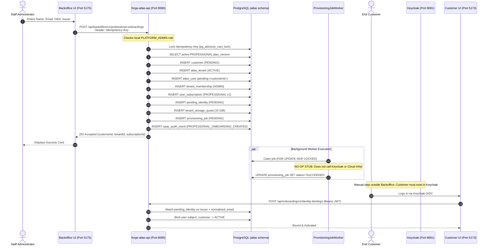
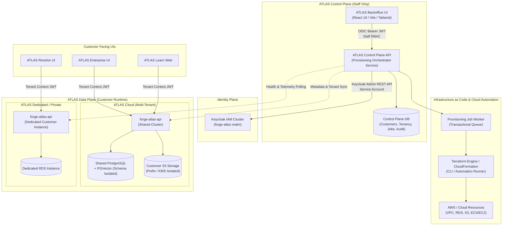
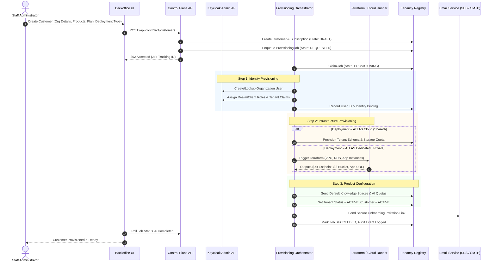
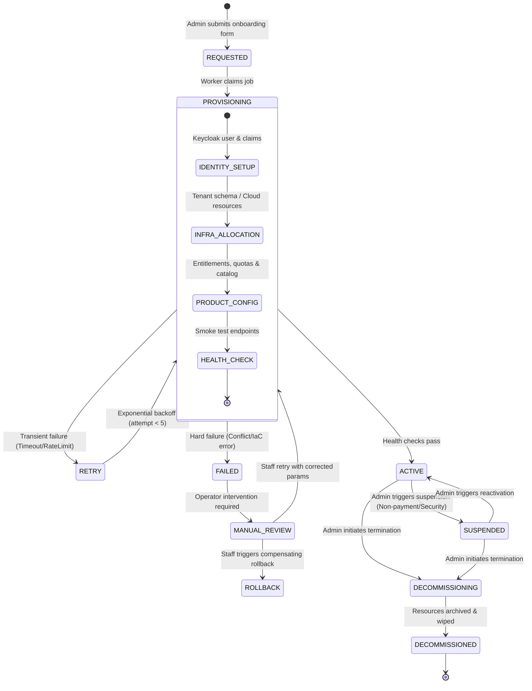
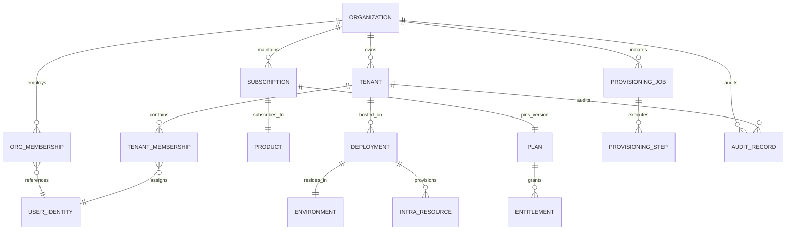

# ATLAS Backoffice — Complete Provisioning & Ecosystem Management Investigation
**Document ID:** NW-ATLAS-BO-GAP-2026-001  
**Version:** 1.0.0  
**Status:** Architecture Assessment & Implementation Roadmap  
**Author:** Neural Works Engineering / Antigravity AI  
**Target Repository:** `forge-atlas-backoffice` (`D:\Development\Spring AI\forge-atlas-backoffice`)  
**Related Repositories:** `forge-atlas-api`, `forge-atlas-ui`, `atlas-learn-ui`, `atlas-resolve-ui`  
**Date:** October 2026  

---

## Table of Contents
1. [A. Executive Summary](#a-executive-summary)
2. [B. Current Architecture Assessment](#b-current-architecture-assessment)
3. [C. Current Feature Inventory](#c-current-feature-inventory)
4. [D. Provisioning Flow Today](#d-provisioning-flow-today)
5. [E. Target Architecture](#e-target-architecture)
   - [E.1 System Context Diagram](#e1-system-context-diagram)
   - [E.2 Customer Provisioning Sequence](#e2-customer-provisioning-sequence)
   - [E.3 Provisioning State Machine](#e3-provisioning-state-machine)
6. [F. Comprehensive Gap Analysis](#f-comprehensive-gap-analysis)
7. [G. Security & Tenant Isolation Findings](#g-security--tenant-isolation-findings)
8. [H. Proposed Domain Model](#h-proposed-domain-model)
9. [I. Proposed Control Plane API Surface](#i-proposed-control-plane-api-surface)
10. [J. Proposed Backoffice Information Architecture & UX](#j-proposed-backoffice-information-architecture--ux)
11. [K. MVP Scope Definition](#k-mvp-scope-definition)
12. [L. Implementation Roadmap (Milestones R0 – R6)](#l-implementation-roadmap-milestones-r0--r6)
13. [M. Recommended Next Implementation Task](#m-recommended-next-implementation-task)

---

## A. Executive Summary

### Overview & Mission
ATLAS Backoffice is envisioned as the central administrative control-plane application for the entire Neural Works ATLAS ecosystem—spanning **ATLAS Enterprise / Core**, **ATLAS Learn**, **ATLAS RESOLVE Personal**, **ATLAS RESOLVE Organization / Teams**, and future shared AI services across three deployment topologies: **ATLAS Cloud** (shared multi-tenant), **ATLAS Dedicated** (dedicated cloud per customer), and **ATLAS Private** (on-premises / VPC customer deployment).

This investigation conducted an exhaustive forensic review of `forge-atlas-backoffice` and its companion backend `forge-atlas-api`, database migrations (`V1`–`V14`), identity configurations, and related UI repositories to determine operational readiness, architectural boundaries, and the technical debt separating current prototypes from a production-grade SaaS control plane.

### Key Investigation Findings

1. **Current State Is a High-Fidelity Front-End Mock / Narrow Vertical Slice:**
   The current `forge-atlas-backoffice` repository is a lightweight Next.js/Vite frontend (powered by `vinext` on Node/Cloudflare) with only two operational screens: a basic Customer Directory/Detail view linked to a single hardcoded plan (`PROFESSIONAL` v1), and a Sri Lanka National Syllabus Curriculum Uploader. The dashboard metrics are hardcoded mocks or partial client-side aggregations of the first 20 records, and the "Provisioning Queue" is static UI placeholder code.

2. **Control Plane / Data Plane Boundary Confusion:**
   The Backoffice has no dedicated backend service; it relies directly on `forge-atlas-api` (the runtime RAG engine and customer data plane). Concurrently, Backoffice directly embeds customer-level runtime data plane operations—specifically uploading textbooks into ATLAS Learn's vector store via `POST /api/v1/learn/resources` with a hardcoded tenant header (`X-Atlas-Tenant-Id: atlas-pilot`). Backoffice acts simultaneously as a platform admin console and an ad-hoc tenant content management tool, violating fundamental control plane separation.

3. **Provisioning Worker Is an In-Memory Stub:**
   While the database schema (`V7__create_professional_saas_onboarding.sql`) and `OnboardingRepository` implement robust transactional SQL and advisory locking for idempotency, the actual provisioning worker (`ProvisioningJobWorker.java`) is a no-op stub: it immediately invokes `succeedJob(job.id())`. It does not provision Keycloak accounts, does not allocate isolated databases/schemas, does not provision S3 buckets, and does not orchestrate any cloud infrastructure or Terraform scripts.

4. **Identity & Access Management Disconnect:**
   Keycloak 26 is used for authentication via `keycloak-js`, but the Keycloak realm (`forge-atlas-realm.json`) does not define the `forge-atlas-backoffice` client, nor does it define administrative roles (`PLATFORM_ADMIN`, `OPERATIONS`, `SUPPORT`). Backoffice access control is enforced entirely inside `forge-atlas-api` by checking an internal database table (`atlas.user_platform_role`). An administrator created in Keycloak cannot manage the platform until a developer manually injects SQL into PostgreSQL.

5. **Tenant Isolation & Cross-Product Risk:**
   ATLAS Learn and ATLAS Enterprise share the same database (`ragdb`) separated only by row-level tenant filtering (`tenant_id` columns and `TenantResolutionFilter`). When Backoffice staff operate across tenants, there is no fine-grained role-based scoping or multi-factor confirmation for destructive operations, posing significant risk of cross-tenant data leakage or inadvertent tenant destruction.

---

## B. Current Architecture Assessment

### B.1 Project Structure & Tech Stack

```
forge-atlas-backoffice/
├── app/
│   ├── layout.tsx                     # Root layout with Geist font
│   ├── globals.css                    # Tailwind CSS v4 styling
│   ├── page.tsx                       # Dashboard Overview (partially mock)
│   ├── customers/
│   │   ├── page.tsx                   # Customer directory listing
│   │   ├── new/page.tsx               # Professional customer onboarding form
│   │   ├── [customerId]/page.tsx      # Customer detail & lifecycle actions
│   │   └── detail/page.tsx            # Duplicate of [customerId]/page.tsx
│   └── curriculum/
│       └── page.tsx                   # 977-line Sri Lanka syllabus ingestion UI
├── components/
│   ├── SidebarNav.tsx                 # Sidebar navigation with active/disabled links
│   └── ui/                            # 35+ Radix / Shadcn UI components
├── lib/
│   ├── atlas-api.ts                   # Fetch API wrapper with Keycloak bearer token
│   ├── atlas-api.test.ts              # 8 Vitest unit tests for HTTP error handling
│   └── utils.ts                       # Class merging utility (clsx, twMerge)
├── hooks/
│   └── use-mobile.ts                  # Responsive drawer/sidebar hook
├── Dockerfile                         # Node 22 Alpine builder / runner image
├── package.json                       # Dependencies: React 19, vinext, keycloak-js
└── vite.config.ts                     # Vite + Cloudflare / RSC plugin configuration
```

### B.2 Frontend Framework & Dependencies
- **Runtime:** Node.js `>=22.13.0`, packaged via Docker Alpine.
- **Framework:** `vinext` (`1.0.0-beta.5`) running Vite 8 and React 19.2.6.
- **Styling:** Tailwind CSS v4.2.1 using `@tailwindcss/postcss`.
- **UI Kit:** `@shadcn/react`, Radix UI primitives, Lucide React icons.
- **Auth Client:** `keycloak-js` (`^26.2.2`) configured with PKCE S256 against `http://localhost:8081`, realm `forge-atlas`.
- **Testing:** Vitest 3.2.4 with JSDOM and `@testing-library/react`.

### B.3 Backend & Persistence Layer (`forge-atlas-api`)
The Backoffice communicates with `forge-atlas-api` (Spring Boot 3.4.x, Java 21) running on port 8080:
- **Endpoints:**
  - `POST /api/backoffice/v1/professional-onboardings` (requires `PLATFORM_ADMIN` and `Idempotency-Key`)
  - `GET /api/backoffice/v1/professional-onboardings` (paginated customer list)
  - `GET /api/backoffice/v1/professional-onboardings/{customerId}` (customer lookup)
  - `PATCH /api/backoffice/v1/professional-onboardings/{customerId}` (lifecycle transitions: `ACTIVE`, `SUSPENDED`, `CLOSED`)
  - `POST /api/onboarding/v1/identity-bindings` (end-user OIDC token self-binding)
  - `GET /api/v1/learn/resources`, `POST /api/v1/learn/resources`, `DELETE /api/v1/learn/resources/{id}` (curriculum ingestion)
- **Database Schema:** PostgreSQL 17 (`ragdb`) in schema `atlas`:
  - `atlas.customer`: Root customer records.
  - `atlas.atlas_tenant`: Tenant records.
  - `atlas.atlas_user`: User identity records with `(issuer, external_subject)`.
  - `atlas.tenant_membership`: User-to-tenant memberships (`ADMIN`, `MEMBER`).
  - `atlas.user_platform_role`: Platform roles (`PLATFORM_ADMIN`).
  - `atlas.user_subscription`: Subscriptions pinned to `plan_version`.
  - `atlas.plan_version`: Plan limits (hardcoded single row: `PROFESSIONAL` v1, 10 GiB, 2 devices).
  - `atlas.pending_identity`: Unbound user invitations.
  - `atlas.provisioning_job`: Job state machine (`PENDING`, `RUNNING`, `SUCCEEDED`, `RETRY`, `FAILED`).
  - `atlas.onboarding_idempotency`: Deduplication table locking SHA-256 hashes.
  - `atlas.saas_audit_event`: Append-only audit log table.
  - `atlas.tenant_storage_quota`: Byte-level storage quotas and reservations.

---

## C. Current Feature Inventory

The following table details every major functional area, assessing UI, Backend/API, actual operational status, and production readiness:

| Area | UI Exists | Backend/API Exists | Functional | Production Ready | Notes & Forensic Observations |
|---|---|---|---|---|---|
| **Staff Authentication** | **EXISTS** (`lib/atlas-api.ts`) | **PARTIAL** (`SecurityConfig.java`) | **PARTIAL** | **NO** | Frontend uses `keycloak-js` with PKCE; backend validates bearer JWT. However, `forge-atlas-realm.json` lacks the `forge-atlas-backoffice` client ID and has no staff roles configured. |
| **Staff Authorization (RBAC)** | **MISSING** | **PARTIAL** (`AuthenticatedSessionService.java`) | **PARTIAL** | **NO** | Binary check: `@authenticatedSessionService.isPlatformAdmin`. Looks up `atlas.user_platform_role` in DB. No fine-grained roles (`SUPPORT`, `BILLING`, `DEVOPS`). UI has no role-aware rendering. |
| **Operations Dashboard** | **PARTIAL** (`app/page.tsx`) | **MISSING** | **MOCK/STUB** | **NO** | Top metrics filter the first page of 20 customers in memory. Provisioning queue items ("Verde Advisory", etc.) and system status are completely hardcoded static HTML. |
| **Customer Directory & Filtering** | **EXISTS** (`app/customers/page.tsx`) | **EXISTS** (`ProfessionalOnboardingController.java`) | **YES** | **PARTIAL** | Paginated search by name/email/tenant, filter by status (`ACTIVE`, `SUSPENDED`, `PENDING`). Production gap: only supports `PROFESSIONAL` personal accounts; lacks organization concepts. |
| **Customer Registration / Onboarding** | **EXISTS** (`app/customers/new/page.tsx`) | **EXISTS** (`ProfessionalOnboardingService.java`) | **PARTIAL** | **NO** | Submits name, email, issuer with idempotency key. Creates DB rows, but underlying provisioning job is a no-op stub. Lacks plan selection, billing ref, and multi-user config. |
| **Customer Lifecycle (Suspend/Close)** | **EXISTS** (`app/customers/[customerId]/page.tsx`) | **EXISTS** (`ProfessionalOnboardingService.java`) | **YES** | **PARTIAL** | Updates status across `customer`, `user_subscription`, and `atlas_tenant` atomically. Lacks suspension reasons, cascading disablement in Keycloak, and resource cleanup. |
| **Tenant Management** | **MISSING** | **PARTIAL** (`atlas.atlas_tenant`) | **PARTIAL** | **NO** | Tenants are implicitly created 1:1 during customer onboarding (`<slug>-<uuid12>`). No dedicated screen to view, edit, search, or configure tenants independently. |
| **Multi-Product Catalog** | **MISSING** | **MISSING** | **NO** | **NO** | No concept of ATLAS Core, Learn, or Resolve products. `plan_version` table is hardcoded to a single `PROFESSIONAL` plan. |
| **Entitlement & Quotas** | **PARTIAL** (detail view shows quota bytes) | **PARTIAL** (`tenant_storage_quota`) | **PARTIAL** | **NO** | Storage quota and max device count exist in DB. AI token limits, knowledge base limits, connector entitlements, and seat limits are missing. |
| **Identity Provisioning (Keycloak)** | **MISSING** | **MISSING** | **NO** | **NO** | Backoffice relies on manual out-of-band user creation in Keycloak. The backend stores a `pending_identity` record waiting for user self-binding on first login. |
| **Deployment Management** | **MISSING** | **MISSING** | **NO** | **NO** | Zero awareness of Cloud vs Dedicated vs Private deployments, server addresses, regions, or cluster assignments. |
| **Infrastructure / Terraform Orchestration** | **MISSING** | **MISSING** | **NO** | **NO** | No IaC integration. Provisioning worker (`ProvisioningJobWorker.java`) logs nothing and immediately completes. |
| **AI / Model Provider Management** | **MISSING** | **PARTIAL** (`SystemInfoController.java`) | **NO** | **NO** | System info endpoint reports runtime model strings, but Backoffice has no controls or visibility into Ollama, Ollama Cloud, OpenAI quotas, or API keys. |
| **Knowledge Base / Ingestion Ops** | **PARTIAL** (`app/curriculum/page.tsx`) | **EXISTS** (`LearnController.java`) | **YES** | **NO** | Curriculum page directly uploads and chunks textbooks for ATLAS Learn. It bypasses control plane isolation, sends raw tenant headers, and lacks failed-job diagnostics. |
| **Usage Metering & Analytics** | **MISSING** | **PARTIAL** (`OperationsController.java`) | **NO** | **NO** | `OperationsController` provides tenant-scoped metrics to customer admins. Backoffice has no cross-tenant global metering for tokens, storage, or API calls. |
| **Audit Log UI** | **MISSING** | **EXISTS** (`atlas.saas_audit_event`) | **NO** | **NO** | Backend writes audit events (`CUSTOMER_STATUS_*`, etc.), but there is no API endpoint to query them and no Backoffice screen to inspect them. |
| **Release & Version Tracking** | **MISSING** | **PARTIAL** (`/api/system`) | **NO** | **NO** | Reports backend version string (`0.1.0-SNAPSHOT`), but there is no deployment registry or version compatibility matrix. |

---

## D. Provisioning Flow Today

### Detailed Trace of Existing Onboarding
The current implementation was designed as "Phase 1 Professional Shared-SaaS Onboarding" (documented in `forge-atlas-api/docs/architecture/professional-saas-onboarding-phase-1.md`). 



### Stage-by-Stage Verification: Exists vs. Missing

```
Stage 1: Customer Record Creation
  Status: [EXISTS]
  Detail: Creates row in atlas.customer with UUID, email, normalized_email, status PENDING.
  Gap: Lacks organization name, customer type, billing address, contact phone, SLA tier.

Stage 2: Tenant Allocation
  Status: [EXISTS - BASIC]
  Detail: Creates row in atlas.atlas_tenant with slug '<name>-<uuid12>' and status ACTIVE.
  Gap: Hardcoded to single personal tenant. Cannot assign multiple tenants, custom slug, or dedicated DB.

Stage 3: Subscription & Product Assignment
  Status: [EXISTS - HARDCODED]
  Detail: Inserts into atlas.user_subscription linked to atlas.plan_version ('PROFESSIONAL', v1).
  Gap: No product selection (Enterprise, Learn, Resolve). No plan tier selection or trial duration.

Stage 4: Deployment & Infrastructure Assignment
  Status: [MISSING]
  Detail: Non-existent. System assumes all tenants share the single local PostgreSQL/pgvector instance.
  Gap: No concept of Cloud vs Dedicated vs Private, target host/cluster, region, or VPC.

Stage 5: Identity & Account Provisioning
  Status: [MOCK / MANUAL]
  Detail: atlas.pending_identity created with placeholder subject 'pending:<uuid>'.
  Gap: Keycloak Admin API is never called. Staff must manually create user in Keycloak or rely on public self-registration.

Stage 6: Infrastructure & Storage Allocation
  Status: [PARTIAL]
  Detail: atlas.tenant_storage_quota initialized to 10 GiB in DB table.
  Gap: No S3 bucket policy created, no KMS key created, no database schema isolated.

Stage 7: Product Configuration & Activation
  Status: [PARTIAL]
  Detail: Customer is activated only when customer performs self-binding via POST /api/onboarding/v1/identity-bindings.
  Gap: No automated welcome email, invitation link generation, or admin-triggered activation bypass.
```

---

## E. Target Architecture

The target architecture establishes a strict separation of concerns:
- **Control Plane (`forge-atlas-backoffice` + Backoffice Control API):** Manages organizations, tenants, subscriptions, identity lifecycle, provisioning workflows, and global observability.
- **Runtime / Data Plane (`forge-atlas-api`, `atlas-learn`, `atlas-resolve`):** Executes business logic, vector search, RAG, and document workflows, strictly isolated by tenant boundaries.

### E.1 System Context Diagram



### E.2 Customer Provisioning Sequence (Target Flow)



### E.3 Provisioning State Machine



---

## F. Comprehensive Gap Analysis

| Capability | Current State | Gap Description | Priority | Recommended Action |
|---|---|---|---|---|
| **Multi-Product Catalog** | Single hardcoded `PROFESSIONAL` row in `plan_version`. | No catalog for Enterprise, Learn, or Resolve; no add-ons or plan tiers. | **P0** | Implement `product`, `plan`, and `feature_entitlement` tables in control plane schema. |
| **Organization Lifecycle** | Only personal accounts (`atlas.customer` 1:1 user). | Cannot model corporate entities, multiple contacts, billing profiles, or multi-tenant orgs. | **P0** | Redefine domain: `Organization` (Customer) has many `Tenants`, `Subscriptions`, and `Users`. |
| **Real Identity Provisioning** | No-op worker; relies on manual Keycloak registration. | Staff cannot automatically create Keycloak users or issue invitations from Backoffice. | **P0** | Build Keycloak Admin API Client with service account credentials to provision users and reset links. |
| **Staff RBAC & Permissions** | Binary `PLATFORM_ADMIN` in local database table. | No role separation (`SUPER_ADMIN`, `SUPPORT`, `BILLING`, `DEVOPS`); no Keycloak role integration. | **P0** | Map Keycloak realm roles (`staff:admin`, `staff:support`, etc.) to Backoffice Spring Security authorities. |
| **Auditing & History UI** | DB table `saas_audit_event` exists; zero UI or query API. | Staff cannot view audit history; destructive actions are invisible to compliance. | **P0** | Expose paginated `/api/control/v1/audit-events` and build dedicated Backoffice Audit Log screen. |
| **Tenant Isolation Guardrails** | Backoffice curriculum tool sends raw tenant headers. | Admin console directly accesses data plane, creating major cross-tenant contamination risk. | **P0** | Remove data-plane ingestion from Backoffice. Shift to metadata management via Control API. |
| **Infrastructure Deployment** | Completely absent. Assumes single shared DB. | Cannot provision Dedicated instances, Private VPCs, or customer-specific database schemas. | **P1** | Implement `deployment` entity and asynchronous IaC runner (Terraform workflow adapter). |
| **Provisioning Step Diagnostics** | Single binary job status; no step logs or error detail. | When provisioning fails, staff cannot see which step failed or safely trigger retries. | **P1** | Add `provisioning_step` table capturing step name, execution time, error payload, and retry count. |
| **AI Provider / Routing Config** | Static string in `SystemInfoController`. | Cannot configure Ollama endpoints, OpenAI models, token quotas, or fallback PILOT routes. | **P1** | Create AI Provider registry managing model assignments, rate limits, and encrypted secret references. |
| **Operations Dashboard Telemetry** | Mock dashboard; hardcoded static cards. | No real-time visibility into system health, active provisioning jobs, or error spikes. | **P1** | Build aggregated telemetry endpoints consuming Spring Boot Actuator, DB health, and job queue states. |
| **Document / Ingestion Ops** | Hardcoded Sri Lanka textbook uploader. | Cannot inspect tenant knowledge base sizes, failed ingestion jobs, OCR throughput, or purge requests. | **P1** | Build Knowledge Operations dashboard tracking ingestion pipelines without exposing raw document text. |
| **Usage Metering & Quotas** | Only storage bytes tracked (`tenant_storage_quota`). | No tracking for LLM tokens, embedding calls, conversations, active seats, or OCR pages. | **P2** | Deploy asynchronous usage event consumer writing to `daily_tenant_usage` aggregates. |
| **Release & Version Registry** | Single version string in `/api/system`. | Cannot track which environment/tenant runs which version or coordinate canary rollouts. | **P2** | Implement Release Registry tracking artifact digests, schema versions, and upgrade readiness. |
| **Billing & Invoicing Hook** | None. | No integration points for Stripe, payment status, invoice references, or renewal dates. | **P3** | Define subscription billing references and webhook handlers for external billing engines. |

---

## G. Security & Tenant Isolation Findings

### 1. High-Severity Finding: Backoffice Curriculum Ingestion Violates Tenant Boundaries
- **Location:** `app/curriculum/page.tsx`, `lib/atlas-api.ts` (lines 162–220), `forge-atlas-api/src/main/java/com/nomesh/rag/learn/LearnController.java`.
- **Finding:** The Backoffice frontend directly uploads binary files to `POST /api/v1/learn/resources` using a user-selectable dropdown with values `atlas-pilot` and `learn-consumer`. It passes `X-Atlas-Tenant-Id` directly in the header.
- **Vulnerability / Risk:** Backoffice operates in the customer runtime data plane. If a staff member uploads an unapproved file or enters an incorrect tenant ID, customer vector stores can be contaminated. Furthermore, `TenantResolutionFilter` rejects requests unless the user has an explicit row in `atlas.tenant_membership`. To bypass this, previous developers added ad-hoc exemptions that weaken tenant isolation.
- **Remediation:** Remove curriculum and textbook uploading from Backoffice. Curriculum management belongs in a dedicated ATLAS Learn content-curation tool or behind an explicit platform ingestion API that strictly validates authority and never bypasses tenancy filters.

### 2. High-Severity Finding: Disconnected Staff RBAC & Privilege Escalation Risk
- **Location:** `forge-atlas-api/src/main/java/com/nomesh/rag/security/AuthenticatedSessionService.java`.
- **Finding:** Backoffice authentication checks `isPlatformAdmin(authentication)` by querying `atlas.user_platform_role` using the JWT `issuer` and `external_subject`. 
- **Vulnerability / Risk:** 
  1. Keycloak realm configuration (`forge-atlas-realm.json`) has no concept of Backoffice staff roles. Any authenticated Keycloak user whose UUID happens to be inserted into `atlas.user_platform_role` becomes an omnipotent `PLATFORM_ADMIN`.
  2. There is no principle of least privilege: support staff investigating a billing question have identical permissions to platform engineers executing tenant shutdowns.
  3. No session timeouts or re-authentication checks exist for destructive operations (e.g. `PATCH ... status=CLOSED`).
- **Remediation:** Configure dedicated Keycloak client roles (`backoffice:super-admin`, `backoffice:ops`, `backoffice:support`, `backoffice:auditor`). Have Spring Security evaluate Keycloak JWT realm/client roles directly.

### 3. Medium-Severity Finding: Hardcoded and Exposed Secrets in Source / Compose
- **Location:** `forge-atlas-api/compose.yaml` (lines 8, 13, 34, 62), `forge-atlas-api/docs/security/keycloak/forge-atlas-realm.json`.
- **Finding:** Hardcoded passwords and shared secrets exist throughout development files (`KC_BOOTSTRAP_ADMIN_PASSWORD: admin-change-me`, `DOCINTEL_JWT_SECRET: neuralworks-production-auth-secret-key-32bytes-minimum`, `POSTGRES_PASSWORD: ragpassword`).
- **Remediation:** Ensure Backoffice never accepts or stores raw secrets (database passwords, LLM provider API keys) in plaintext. All secrets must reference an external secret store (AWS Secrets Manager / Vault) via ARN or key alias.

### 4. Medium-Severity Finding: Destructive Actions Without Multi-Step Authorization or Reason Logging
- **Location:** `app/customers/[customerId]/page.tsx` (lines 43–65), `OnboardingRepository.java` (lines 142–148).
- **Finding:** Clicking "Close" immediately updates customer status to `CLOSED`, sets subscription to `CANCELLED`, and suspends the tenant in a single database transaction. No reason code, confirmation phrase, or secondary approval is required.
- **Remediation:** Require a mandatory comment/ticket reference and confirmation challenge for all destructive transitions (`SUSPEND`, `CLOSE`, `DECOMMISSION`), and record the reason in the audit log.

---

## H. Proposed Domain Model

The target domain model replaces the simplistic 1:1 Customer-Tenant mapping with a flexible enterprise hierarchy capable of supporting both single-user Professional subscriptions and multi-tenant Enterprise conglomerates.



### Entity Definitions & Service Ownership

| Entity | Primary Attributes | Owner Service | Description |
|---|---|---|---|
| **Organization** (`Customer`) | `id`, `org_code`, `legal_name`, `status`, `tier`, `billing_email`, `created_at` | Control Plane | Top-level commercial and legal entity (customer). |
| **Tenant** | `id`, `org_id`, `product_code`, `slug`, `isolation_level`, `status`, `region` | Control Plane | Security and data boundary. An Org can have multiple tenants (e.g. Learn vs Enterprise). |
| **Subscription** | `id`, `org_id`, `product_id`, `plan_id`, `status`, `start_date`, `renewal_date` | Control Plane | Commercial agreement defining licensed product, billing cadence, and plan limits. |
| **Product & Plan** | `code`, `name`, `version`, `status`, `base_storage_gb`, `base_seats`, `base_tokens` | Control Plane | Product catalog definitions (ATLAS Core, Learn, Resolve) and immutable versioned plans. |
| **Entitlement** | `id`, `plan_id`, `feature_key`, `limit_type`, `limit_value`, `is_enabled` | Control Plane | Specific capability toggles (e.g. `OCR_INGESTION`, `DEVICE_LIMIT: 2`, `SEATS: 50`). |
| **User Reference** | `id`, `keycloak_sub`, `email`, `display_name`, `global_status` | Identity (KC) / Control | Mirror of identity accounts linked to Organizations and Tenants with role assignments. |
| **Deployment** | `id`, `tenant_id`, `deployment_type`, `environment_id`, `cluster_ref`, `status`, `app_version` | Control Plane / IaC | Runtime deployment target (`CLOUD_SHARED`, `DEDICATED_AWS`, `PRIVATE_ONPREM`). |
| **Environment** | `id`, `name`, `type` (`PROD`, `STAGING`, `DEV`), `region`, `vpc_id` | Control Plane / IaC | Physical or logical cloud environment where services run. |
| **ProvisioningJob** | `id`, `org_id`, `tenant_id`, `job_type`, `status`, `attempts`, `error_summary` | Provisioning Service | Durable orchestrator workflow tracking end-to-end setup. |
| **ProvisioningStep** | `id`, `job_id`, `step_name`, `status`, `input_payload`, `error_details`, `execution_ms` | Provisioning Service | Granular execution record for each stage (Keycloak, DB Schema, S3, DNS). |
| **AuditEvent** | `id`, `actor_sub`, `actor_role`, `action`, `target_type`, `target_id`, `prev_state`, `new_state`, `reason` | Control Plane | Immutable, append-only security and operational audit trail. |

---

## I. Proposed Control Plane API Surface

All control-plane endpoints will be hosted under `/api/control/v1` and require authenticated staff bearer tokens evaluated by role-based authorization filters.

### 1. Customer & Organization Management
- `POST /api/control/v1/organizations` — Register new customer organization.
- `GET /api/control/v1/organizations` — Paginated search and filtering of organizations.
- `GET /api/control/v1/organizations/{orgId}` — Retrieve full organization details, tenants, and active plans.
- `PATCH /api/control/v1/organizations/{orgId}/lifecycle` — Transition organization status (`ACTIVE`, `SUSPENDED`, `ARCHIVED`) with mandatory audit reason.

### 2. Tenant Management
- `POST /api/control/v1/organizations/{orgId}/tenants` — Create a new tenant under an organization for a specific product.
- `GET /api/control/v1/tenants` — Global tenant search across all products and organizations.
- `GET /api/control/v1/tenants/{tenantId}` — Tenant status, isolation mode, database host, storage usage, and version.
- `PATCH /api/control/v1/tenants/{tenantId}/status` — Suspend or reactivate an individual tenant.

### 3. Product Catalog & Subscriptions
- `GET /api/control/v1/products` — List all ATLAS products and available plans.
- `POST /api/control/v1/organizations/{orgId}/subscriptions` — Assign a new product subscription to a customer.
- `PATCH /api/control/v1/subscriptions/{subId}/plan` — Upgrade or modify plan version and entitlements.

### 4. Identity & User Administration
- `POST /api/control/v1/tenants/{tenantId}/users` — Provision a user into Keycloak and assign tenant membership.
- `GET /api/control/v1/tenants/{tenantId}/users` — List active users and assigned roles for a tenant.
- `POST /api/control/v1/users/{userId}/invite` — Generate/re-send secure passwordless setup link or reset invitation.
- `DELETE /api/control/v1/tenants/{tenantId}/users/{userId}` — Revoke tenant membership and disable user credentials.

### 5. Provisioning Workflow Engine
- `GET /api/control/v1/provisioning/jobs` — Real-time queue view of active, failed, and queued provisioning jobs.
- `GET /api/control/v1/provisioning/jobs/{jobId}` — Detailed step-by-step breakdown of execution status and error stack traces.
- `POST /api/control/v1/provisioning/jobs/{jobId}/retry` — Safely retry a failed provisioning job from the point of failure.

### 6. Operations & Infrastructure Telemetry
- `GET /api/control/v1/operations/dashboard` — Platform overview KPIs (active customers, provisioning throughput, error rates).
- `GET /api/control/v1/infrastructure/environments` — Status and health of AWS/database/Keycloak environments.
- `GET /api/control/v1/ai/providers` — Health, active models, and token consumption metrics per model provider.
- `GET /api/control/v1/audit-events` — Searchable, filterable audit log by actor, organization, tenant, or action.

---

## J. Proposed Backoffice Information Architecture & UX

The proposed navigation redesign aligns Backoffice with standard enterprise control planes, grouping features by administrative domain while removing data-plane contamination.

```
ATLAS Staff Backoffice
├── Overview (Dashboard)
│   ├── Business KPIs (Total Orgs, Active Tenants, MRR / Subscription Count)
│   ├── Operations Health (Active Jobs, Failed Provisioning Alerts, Error Rates)
│   └── System Status (Keycloak, PGVector DBs, AI Model Providers)
│
├── Customers & Organizations
│   ├── Organization Directory (Search, Filter by Tier / Status)
│   ├── Register New Customer (Multi-step Onboarding Wizard)
│   └── Organization Detail
│       ├── Overview & Contacts
│       ├── Subscriptions & Commercial Terms
│       ├── Assigned Tenants
│       └── Audit Trail
│
├── Tenancy
│   ├── Global Tenant Directory
│   ├── Tenant Detail (Isolation mode, DB allocation, Storage quota)
│   └── User & Role Assignment
│
├── Products & Catalog
│   ├── Product Matrix (Core, Learn, Resolve)
│   ├── Plan Versions & Pricing Tiers
│   └── Feature Entitlements & Flag Overrides
│
├── Provisioning Orchestration
│   ├── Active Job Queue
│   ├── Job Detail (Step timeline, execution logs, payload inspector)
│   └── Failed Jobs & Recovery Actions (Retry, Compensate, Abort)
│
├── Infrastructure & AI Operations
│   ├── Environments & Deployments (Cloud Shared, Dedicated, Private)
│   ├── AI Model Providers (Ollama, Ollama Cloud, OpenAI-compatible routes)
│   └── Ingestion Pipeline Monitor (Document jobs, OCR status, Failed chunks)
│
├── Security & Access
│   ├── Backoffice Staff Users & RBAC
│   ├── Platform Audit Log (Searchable, Exportable)
│   └── Security Alerts (Suspicious logins, Cross-tenant rejections)
│
└── System
    ├── Application Versions & Release Gates
    ├── Runtime Feature Flags
    └── Health & Actuator Telemetry
```

---

## K. MVP Scope Definition

To launch a production-capable Backoffice capable of onboarding the first 10–100 customers safely without over-engineering, we establish a strict boundary between MVP (Must-Have), Phase 2 (Operational Maturity), and Phase 3 (Commercial Scale).

### MVP / Must Have (R0 – R2)
1. **Real Keycloak Identity Provisioning:** Automated creation of customer owner accounts in Keycloak via Keycloak Admin REST API with secure invitation links.
2. **Organization & Multi-Tenant Model:** Support creating an Organization with an assigned Tenant for a specific ATLAS product.
3. **Product & Plan Assignment:** Support selecting from ATLAS Enterprise Core, ATLAS Learn, or ATLAS Resolve with pinned plan limits.
4. **Resilient Provisioning State Machine:** Durable step-tracking (`REQUESTED` → `PROVISIONING` → `ACTIVE` / `FAILED`) with step logs and manual retry in the UI.
5. **Customer Lifecycle Management:** Suspend, Reactivate, and Close customer accounts with mandatory reason logging and Keycloak disablement.
6. **Keycloak-Backed Staff RBAC:** Restrict Backoffice access using real Keycloak roles (`SUPER_ADMIN`, `OPERATIONS`, `SUPPORT`).
7. **Audit Log UI:** Full audit logging for every customer, tenant, and user modification, viewable in Backoffice.
8. **Real Operations Dashboard:** Overview displaying real database counts, active provisioning jobs, and system health status.

### Phase 2: Operational Maturity (R3 – R4)
1. **Terraform / Cloud Provisioning Runner:** Automation for dedicated customer VPCs, RDS instances, and S3 buckets.
2. **AI Provider Management:** Dynamic routing between local Ollama and Ollama Cloud, token quotas, and provider health checks.
3. **Knowledge Operations Hub:** Cross-tenant ingestion telemetry, failed OCR job retries, and vector store re-indexing controls.
4. **Granular Usage Metering:** Ingestion of token, storage, and API metrics with alerting on quota breaches.
5. **Release & Version Registry:** Environment-level version tracking and release gate status.

### Phase 3: Commercial Scale (R5 – R6)
1. **Self-Service Customer Portal Integration:** Allow customers to manage their own seats, billing, and add-ons.
2. **Stripe / Payment Gateway Automation:** Webhook synchronization for automated subscription renewal, invoicing, and delinquent account suspension.
3. **Advanced Anomaly & Fraud Detection:** Automated detection of cross-tenant leakage attempts and token abuse.
4. **Multi-Region & Private VPC Deployment Federation:** Control plane agents orchestrating air-gapped on-premises deployments.

---

## L. Implementation Roadmap (Milestones R0 – R6)

### Milestone R0: Foundation, Security & Control Plane Separation
- **Objective:** Establish proper Control Plane architectural boundaries, configure Keycloak staff RBAC, and eliminate cross-product data-plane contamination.
- **Backend Changes (`forge-atlas-api`):**
  - Create dedicated `/api/control/v1/**` security configuration evaluating Keycloak realm/client roles (`PLATFORM_ADMIN`, `SUPPORT`, `DEVOPS`).
  - Deprecate `/api/backoffice/v1/professional-onboardings` in favor of control plane endpoints.
  - Implement Keycloak Admin Client (`KeycloakAdminService`) using client-credentials grant.
- **Frontend Changes (`forge-atlas-backoffice`):**
  - Register `forge-atlas-backoffice` client in Keycloak realm and update `keycloak-js` init.
  - Remove `app/curriculum/page.tsx` and data-plane resource upload endpoints.
  - Implement role-aware sidebar navigation and route guards.
- **Database Changes:**
  - Create initial control plane schema migrations: `control.organization`, `control.staff_role`.
- **Integrations:** Keycloak Admin REST API.
- **Tests:** Unit & integration tests for Keycloak token role parsing and endpoint authorization.
- **Risks:** Disruption of current local onboarding workflow during transition.
- **Definition of Done:** Backoffice authenticates via Keycloak with staff roles, and non-admins receive 403 Forbidden.

### Milestone R1: Customer & Tenant Management
- **Objective:** Replace single-user customer onboarding with an Enterprise Organization and Tenant hierarchy.
- **Backend Changes:**
  - Implement `OrganizationService` and `TenantService`.
  - Add endpoints: `POST /api/control/v1/organizations`, `GET /api/control/v1/organizations`, `POST /api/control/v1/organizations/{id}/tenants`.
  - Add lifecycle transition handler with reason logging.
- **Frontend Changes:**
  - Redesign Customer Directory to display Organizations, customer tier, and active tenants.
  - Build multi-step Customer Registration Wizard (Org info, contact details, initial tenant).
  - Build Organization Detail page with tabs: Overview, Tenants, Subscriptions, Audit Log.
- **Database Changes:**
  - Flyway migration creating `control.organization`, `control.tenant`, `control.organization_contact`.
- **Integrations:** Control Plane DB.
- **Tests:** MockMvc controller tests, transactional lifecycle transition tests.
- **Definition of Done:** Staff can create an organization, provision an associated tenant, and transition status between Active and Suspended.

### Milestone R2: Product Catalog & Identity Provisioning
- **Objective:** Support multi-product subscriptions and real user provisioning in Keycloak.
- **Backend Changes:**
  - Implement Product Catalog repository (`product`, `plan`, `entitlement`).
  - Integrate `KeycloakAdminService` into onboarding: automatically creates user in Keycloak, sets email-verified, and dispatches credential setup email.
  - Expose user invitation and password-reset trigger endpoints.
- **Frontend Changes:**
  - Add Product & Plan selection dropdowns in onboarding wizard.
  - Add Tenant Users tab in Organization Detail showing Keycloak sync state and "Resend Invite" button.
- **Database Changes:**
  - Flyway migration for `control.product`, `control.plan_version`, `control.plan_entitlement`, `control.user_reference`.
- **Integrations:** Keycloak User & Group APIs.
- **Tests:** Keycloak mock server integration tests verifying user creation and role mapping.
- **Definition of Done:** Onboarding a customer automatically creates a verified Keycloak user account and binds it to the tenant.

### Milestone R3: Resilient Provisioning Orchestrator
- **Objective:** Build an asynchronous, durable workflow engine with step-level tracking, error capture, and manual retry.
- **Backend Changes:**
  - Implement `ProvisioningOrchestrator` executing discrete steps: `IDENTITY_PROVISION`, `SCHEMA_PROVISION`, `STORAGE_PROVISION`, `CATALOG_SEED`, `HEALTH_CHECK`.
  - Implement step-level logging and error persistence.
  - Expose `/api/control/v1/provisioning/jobs` and `/api/control/v1/provisioning/jobs/{id}/retry`.
- **Frontend Changes:**
  - Build dedicated Provisioning Queue screen with real-time status badges.
  - Build Job Detail modal displaying step progress bar, execution timeline, and error inspection.
  - Add "Retry Failed Step" button.
- **Database Changes:**
  - Migrations for `control.provisioning_job` and `control.provisioning_step`.
- **Integrations:** Provisioning job queue with `SKIP LOCKED` concurrency.
- **Tests:** Chaos/failure injection tests verifying idempotency and retry behavior on step failure.
- **Definition of Done:** When a step fails (e.g. simulated network error), the job pauses in `FAILED`, displays the exact error in Backoffice, and resumes upon operator retry.

### Milestone R4: Deployment & Infrastructure Visibility
- **Objective:** Provide Backoffice visibility into infrastructure environments, deployment models (Cloud/Dedicated/Private), and AI providers.
- **Backend Changes:**
  - Implement `DeploymentRegistryService` tracking environments, host URLs, and cluster health.
  - Implement `AIProviderAdminService` querying model availability (Ollama / Ollama Cloud / OpenAI).
  - Expose endpoints for environment health and AI telemetry.
- **Frontend Changes:**
  - Build Infrastructure & Environments overview screen.
  - Build AI Providers screen showing active models, provider latency, and fallback routing status.
- **Database Changes:**
  - Migrations for `control.environment`, `control.deployment`, `control.ai_provider_config`.
- **Integrations:** Spring Boot Actuator health endpoints, Ollama `/api/tags` health check.
- **Tests:** Integration tests verifying provider health polling and error handling.
- **Definition of Done:** Backoffice dashboard displays live status of all database, identity, and AI inference dependencies.

### Milestone R5: Usage Metering, Operations & Auditing
- **Objective:** Provide operational oversight over knowledge ingestion pipelines, tenant usage quotas, and compliance auditing.
- **Backend Changes:**
  - Implement asynchronous usage aggregation listener (`daily_tenant_usage`).
  - Implement `KnowledgeOperationsService` exposing ingestion status, document counts, and OCR failure queues.
  - Implement Audit Query API with flexible filtering.
- **Frontend Changes:**
  - Build Operations Dashboard with real metrics.
  - Build Knowledge Operations screen for ingestion diagnostics and re-indexing triggers.
  - Build Audit Log viewer with JSON detail modal.
- **Database Changes:**
  - Migrations for `control.daily_tenant_usage`, `control.audit_event` indexes.
- **Integrations:** Micrometer / Prometheus metrics exporter.
- **Tests:** Performance tests verifying audit query execution speed on 1M+ rows.
- **Definition of Done:** Staff can view aggregated usage across tenants and inspect a complete audit trail for any operational event.

### Milestone R6: Commercial Automation & Billing Hooks
- **Objective:** Integrate billing references, invoice tracking, and automated renewal/suspension workflows.
- **Backend Changes:**
  - Implement webhook receivers for billing events (payment succeeded, payment failed, subscription canceled).
  - Implement automated account suspension for past-due accounts.
- **Frontend Changes:**
  - Add Billing & Invoices tab to Organization Detail.
  - Build manual billing override controls (grace period extension).
- **Database Changes:**
  - Migrations for `control.billing_account`, `control.invoice_reference`.
- **Integrations:** Stripe or external billing engine webhook receiver.
- **Tests:** Webhook signature verification and idempotency tests.
- **Definition of Done:** Inbound billing webhooks automatically update subscription status in Backoffice without manual intervention.

---

## M. Recommended Next Implementation Task

### Recommendation: Milestone R0 — Foundation, Security & Keycloak RBAC Realignment

Before writing any new business features or extending database models, the engineering team must resolve the critical security and architectural boundary flaws:

1. **Configure Keycloak Realm & Client:** Register `forge-atlas-backoffice` properly in Keycloak with standard PKCE and declare realm roles: `staff:super-admin`, `staff:operations`, `staff:support`.
2. **Real Security Filter in Backend:** Replace the ad-hoc `isPlatformAdmin` database query with real JWT claim role extraction in `forge-atlas-api` under a dedicated `/api/control/v1/**` path.
3. **Purge Data-Plane Contamination:** Remove the 977-line `app/curriculum/page.tsx` from Backoffice. Backoffice must not directly upload curriculum resources into tenant vector stores via raw tenant headers.
4. **Clean Navigation & Layout Baseline:** Update `SidebarNav.tsx` to reflect the approved control plane information architecture, establishing placeholder routes with proper authentication guards.

**Why this is the single best next milestone:**  
Starting with customer or tenant features on the existing codebase would build upon a broken security model (hardcoded database roles, unconfigured Keycloak client, and data-plane crossover). Establishing clean security boundaries and API contracts in **R0** ensures all subsequent feature milestones are built on a secure, production-ready foundation.
